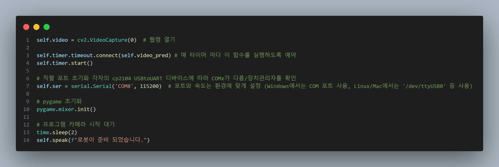
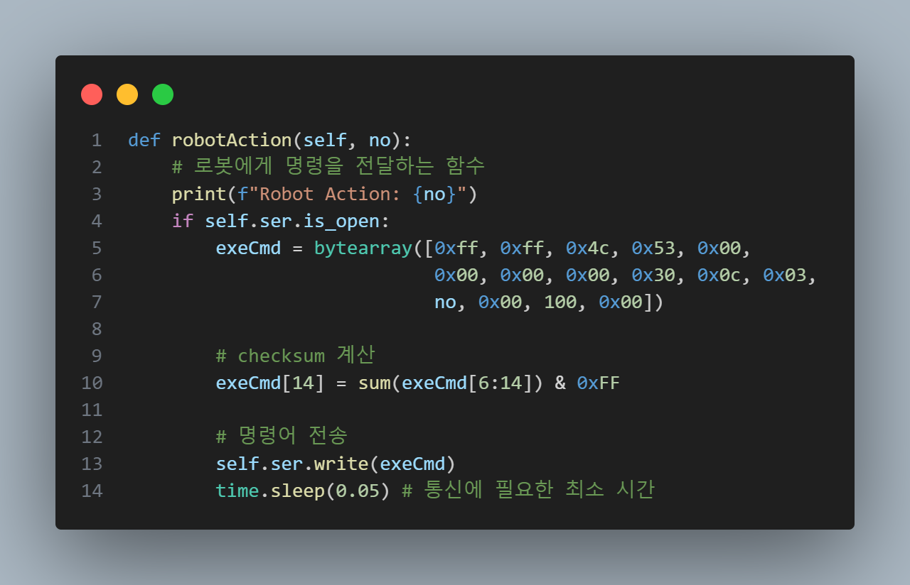

# nativeAPP This is a yolov5's Gui program 

1. 새폴더 만들고 CMD 에서 (또는 vscode 터미널에서) 소스코드를 복사
   ```
   git clone 해당 레포 주소
   ```
3. 새로운 개발환경 만들고
   ```
   create -n yologui2 python=3.9
   ```
4. 콘다 Activate 또는 vscode 에서 개발환경 연결해주고
   ```
   conda activate yologui2
   ```
5. 개발환경 Package 설치 하고
   ```
   pip install -r requirements.txt
   ```
6. yolov5를 클로닝해 오고(REPO에서는 보이지 않지만)
   ```
   git clone https://github.com/ultralytics/yolov5.git
   
7. 다음과 같은 Tree 구조가 만들어지면 오케이
   
## 폴더구조는 


8. 실행은 windowAPP_feat_Humanoid_tts.py

## 프로그램 실행 결과는 


##  이 프로그램은 인식 결과에 따라서 휴머노이드 로봇에게 특정 행동을 하도록 한다. 
##  tts를 이용해서 음성 출력을 하도록 하였다. stt는 반대로 음성을 인식하는것을 말함 

프로그램 실행 결과는 

## 로봇을 움직이기 위해서는 먼저 SerialPort 객체를 가져와야 한다. 
### PC에 없는 포트를 만들기 위해 cp2104라는 USBtoUART 변환젠더를 사용했고 드라이버가 필요하다. 
```
http://www.iamamaker.kr/ko/tutorials/cp210x-usb-to-uart-%EB%93%9C%EB%9D%BC%EC%9D%B4%EB%B2%84-%EC%84%A4%EC%B9%98%ED%95%98%EA%B8%B0/
```


### 로봇을 움직이는 코드는 아두이노의 코드를 파이썬으로 변환 해서 사용하였다. 


